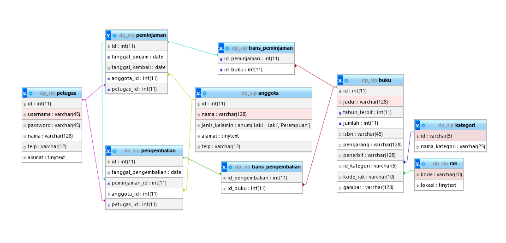

# Kelompok-1-SIP
A team based mini project made with PHP MVC for assignment in MSIB 6 - PT Otak Kanan

## Cara Install dan menggunakan
1. Clone repository ini `git clone https://github.com/faykarr/kelompok-1-sip.git`
2. Masuk ke folder project `cd kelompok-1-sip`
3. Konfigurasi BASE_URL & database di `config/config.php`
4. Import database `db_sip.sql` dan database akan langsung terbuat
5. Jalankan server dengan ketik di terminal `php -S localhost:8000 -t public`
6. Buka browser dan akses `http://localhost:8000`

## Database design
<!-- Add img in public/db-design.png -->

## Some Screenshots
<!-- Add img in public/img/master-rak.png -->

